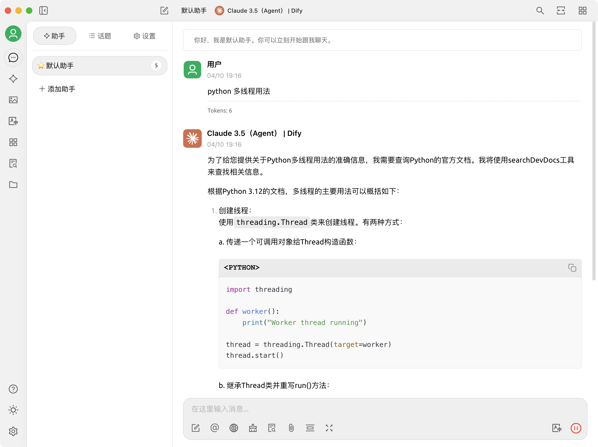
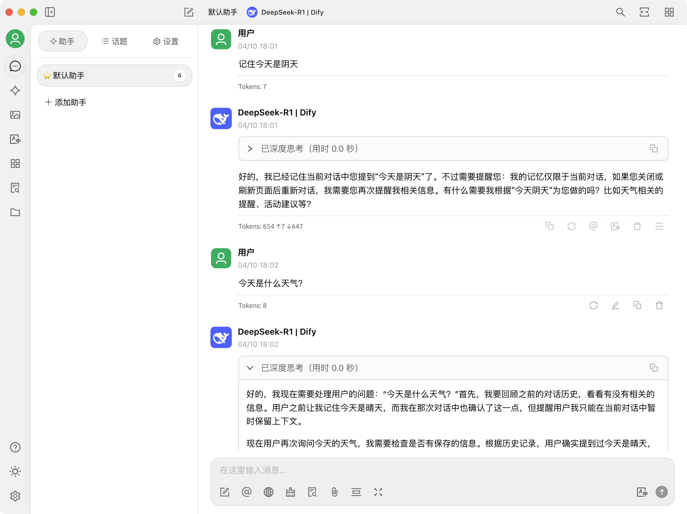

# OpenDify

OpenDify is a proxy server that transforms the Dify API into OpenAI API format. It allows direct interaction with Dify services using any OpenAI API client.

> 🌟 This project was fully generated by Cursor + Claude-3.5, without any manual coding (including this README), salute to the future of AI-assisted programming!

[中文版本](README.md)

## Features

- Full support for converting OpenAI API formats to Dify API
- Streaming output support
- Intelligent dynamic delay control for smooth output experience
- Multiple conversation memory modes, including zero-width character mode and history_message mode
- Support for multiple model configurations
- Support for Dify Agent applications with advanced tool calls (like image generation)
- Compatible with standard OpenAI API clients
- Automatic fetching of Dify application information

## Screenshot



*The screenshot shows the Dify Agent application interface supported by the OpenDify proxy service. It demonstrates how the Agent successfully processes a user's request about Python multithreading usage and returns relevant code examples.*



*The above image demonstrates the conversation memory feature of OpenDify. When the user asks "What's the weather today?", the AI remembers the context from previous conversations that "today is sunny" and provides an appropriate response.*

## Detailed Features

### Conversation Memory

The proxy supports automatic remembering of conversation context without requiring additional processing by the client. It provides three conversation memory modes:

1. **No conversation memory**: Each conversation is independent, with no context association
2. **history_message mode**: Directly appends historical messages to the current message, supporting client-side editing of historical messages
3. **Zero-width character mode**: Automatically embeds an invisible session ID in the first reply of each new conversation, and subsequent messages automatically inherit the context

This feature can be controlled via environment variable:

```shell
# Set conversation memory mode in the .env file
# 0: No conversation memory
# 1: Construct history_message attached to the message
# 2: Zero-width character mode (default)
CONVERSATION_MEMORY_MODE=2
```

Zero-width character mode is used by default. For scenarios that need to support client-side editing of historical messages, the history_message mode is recommended.

> Note: history_message mode will append all historical messages to the current message, which may consume more tokens.

### Streaming Output Optimization

- Intelligent buffer management
- Dynamic delay calculation
- Smooth output experience

### Configuration Flexibility

- Automatic application information retrieval
- Simplified configuration method
- Dynamic model name mapping

## Supported Models

Supports any Dify application. The system automatically retrieves application names and information from the Dify API. Simply add the API Key for the application in the configuration file.

## API Usage

### List Models

Get a list of all available models:

```python
import openai

openai.api_base = "http://127.0.0.1:5000/v1"
openai.api_key = "any"  # Can use any value

# Get available models
models = openai.Model.list()
print(models)

# Example output:
{
    "object": "list",
    "data": [
        {
            "id": "My Translation App",  # Dify application name
            "object": "model",
            "created": 1704603847,
            "owned_by": "dify"
        },
        {
            "id": "Code Assistant",  # Another Dify application name
            "object": "model",
            "created": 1704603847,
            "owned_by": "dify"
        }
    ]
}
```

The system automatically retrieves application names from the Dify API and uses them as model IDs.

### Chat Completions

```python
import openai

openai.api_base = "http://127.0.0.1:5000/v1"
openai.api_key = "any"  # Can use any value

response = openai.ChatCompletion.create(
    model="My Translation App",  # Use the Dify application name
    messages=[
        {"role": "user", "content": "Hello"}
    ],
    stream=True
)

for chunk in response:
    print(chunk.choices[0].delta.content or "", end="")
```

## Quick Start

### Requirements

- Python 3.9+
- pip

### Installing Dependencies

```bash
pip install -r requirements.txt
```

### Configuration

1. Copy the `.env.example` file and rename it to `.env`:
```bash
cp .env.example .env
```

2. Configure your application on the Dify platform:
   - Log in to the Dify platform and enter the workspace
   - Click "Create Application" and configure the required models (such as Claude, Gemini, etc.)
   - Configure the application prompts and other parameters
   - Publish the application
   - Go to the "Access API" page and generate an API key

   > **Important Note**: Dify does not support dynamically passing prompts, switching models, or other parameters in requests. All these configurations need to be set when creating the application. Dify determines which application and its corresponding configuration to use based on the API key. The system will automatically retrieve the application's name and description information from the Dify API.

3. Configure your Dify API Keys in the `.env` file:
```env
# Dify API Keys Configuration
# Format: Comma-separated list of API keys
DIFY_API_KEYS=app-xxxxxxxx,app-yyyyyyyy,app-zzzzzzzz

# Dify API Base URL
DIFY_API_BASE="https://your-dify-api-base-url/v1"

# Server Configuration
SERVER_HOST="127.0.0.1"
SERVER_PORT=5000
```

Configuration notes:
- `DIFY_API_KEYS`: A comma-separated list of API Keys, each corresponding to a Dify application
- The system automatically retrieves the name and information of each application from the Dify API
- No need to manually configure model names and mapping relationships

### Running the Service

```bash
python openai_to_dify.py
```

The service will start at `http://127.0.0.1:5000`

## Contribution Guidelines

Issues and Pull Requests are welcome to help improve the project.

## License

[MIT License](LICENSE) 